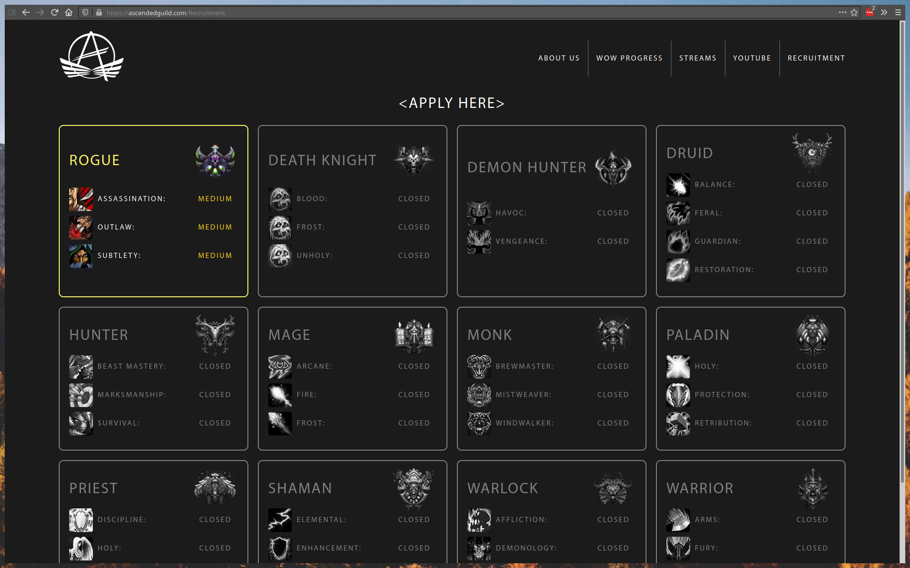

# Official website for the World of Warcraft guild <Ascended>

A stylish, fully custom, and practical first point of contact for prospective new members.

## Features
- Simple login and edit-in-place interface for the end users
- Intuitive board showing all positions currently available
- Fully responsive
- Showcases the guild's Twitch.io streamers

## Technologies used
- ASP.NET Core MVC
- Entity Framework Core
- C#
- HTML
- CSS
- Javascript

## Credits
- Icons from [Font Awesome](https://fontawesome.com/)

## Deploy
1. Set the following environment variables:
- `ASCENDED__DB`
- `ASCENDED__ADMIN_EMAIL`
- `ASCENDED__ADMIN_PWD`

2. Create Docker image  
`docker build -t ascended-image .`

3. Start Docker container  
`docker run -e ASCENDED__DB -e ASCENDED__ADMIN_PWD -e ASCENDED__ADMIN_EMAIL -it --rm -p 5089:80 --name ascended-container ascended-image`
